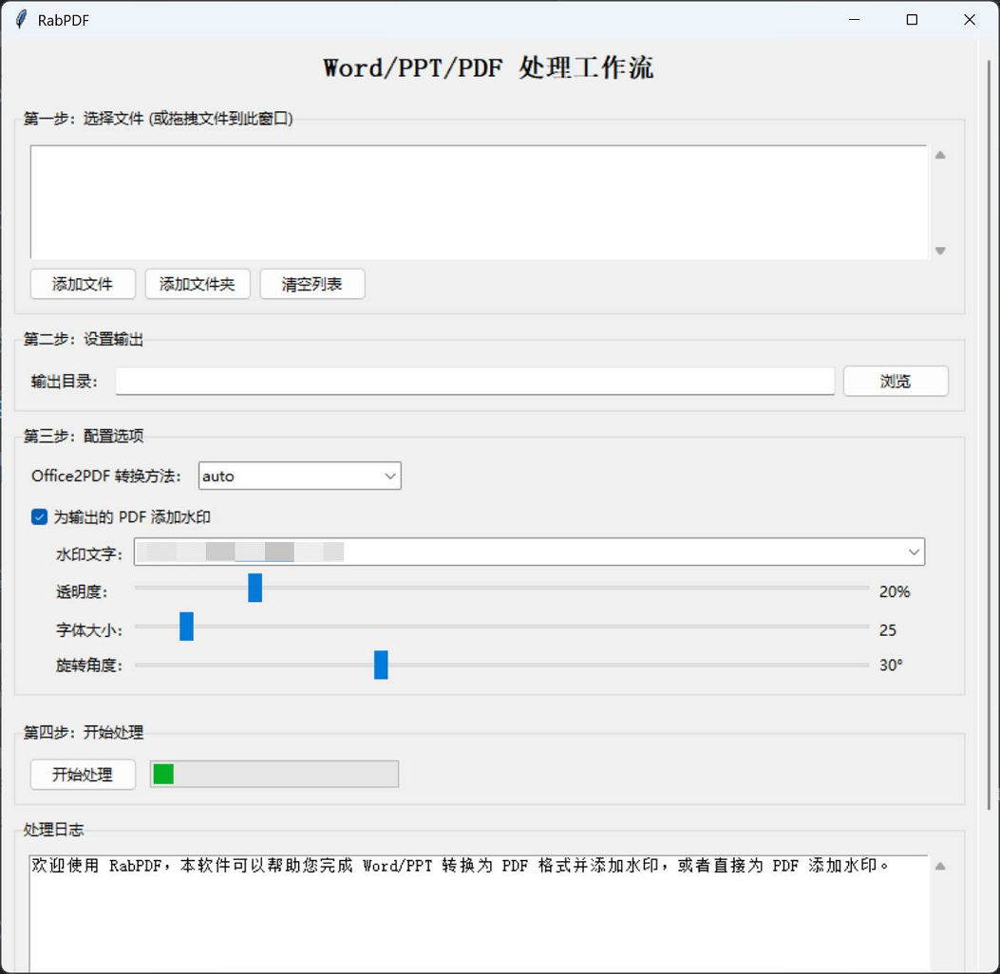

# RabPDF (Rabbit PDF)

**RabPDF** is a lightweight, cross-platform GUI application for batch converting Word and PowerPoint documents to PDF, and for applying full-page watermarks to PDF files. Designed with convenience and cost-effectiveness in mind, RabPDF aims to streamline a common workflow for professionals handling documents.

## Features

- ✅ Drag-and-drop support for adding files and folders
- ✅ Convert `.doc`, `.docx`, `.ppt`, `.pptx` to PDF
- ✅ Add customizable full-page watermarks to PDFs
- ✅ Support PDF watermarking directly without conversion
- ✅ Customize watermark text, font size, opacity, rotation angle, and persist settings locally
- ✅ Store and recall the 5 most recent watermark presets for quick access
- ✅ Integrated installer for [LibreOffice](https://www.libreoffice.org/), or redirect to its official download page
- ✅ Detects and validates LibreOffice installation status
- ✅ Toggle between `COM` and `LibreOffice` modes on Windows

## Motivation

In my daily work, I frequently send internal company documents with watermarks to clients. However, existing solutions are often:

- Expensive or subscription-based
- Incomplete, requiring multiple separate tools
- Lacking cross-platform compatibility

RabPDF addresses these gaps by providing an integrated, Python-powered, cross-platform tool with a user-friendly GUI that simplifies the entire process.

## Technical Design

### Windows Support

- Utilizes the native `COM (Component Object Model)` interface to interact directly with Microsoft Word and PowerPoint.
- Compatible with many versions of Microsoft Office and some versions of WPS (verified in practice).

### Cross-Platform Support

- Uses [LibreOffice](https://www.libreoffice.org/) in headless mode for document conversion on **both Windows and macOS**.
- Applies full-page PDF watermarks via the [`PyPDF2`](https://github.com/py-pdf/PyPDF2) library.

## Compatibility

RabPDF has been tested and verified on the following environments:

|         OS          |      Office Software      |
| :-----------------: | :-----------------------: |
|     Windows x64     | Microsoft Office 2506 x64 |
|     Windows x64     |    LibreOffice 25.2.5     |
|     macOS Intel     |    LibreOffice 25.2.5     |
| macOS Apple Silicon |    LibreOffice 25.2.5     |

## Development Notes

- Developed using **JetBrains PyCharm** – thank you for the excellent IDE.
- Built with the help of **Claude Opus 4** and **Gemini 2.5 Pro**.
- Application icon was generated by **ChatGPT-4o**.

## Screenshots

